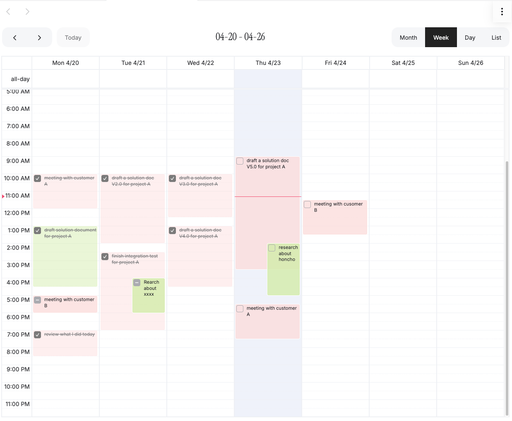

# Obsidian Calendar

[](https://ko-fi.com/thatyolanda)

一个基于 Obsidian 自定义视图的日历插件项目，源码位于 `src/`，构建产物输出到插件根目录。


## Development

- Node.js 18+
- `pnpm install`
- `pnpm dev`：监听并构建
- `pnpm build`：生产构建
- `pnpm lint`：检查代码
- `pnpm lint:fix`：修复可自动修复的问题
- `pnpm format`：格式化 `src/`

## Project structure

- `src/main.ts`：插件入口与生命周期
- `src/services/`：数据读取与事件映射
- `src/view/`：日历视图与模态框
- `src/settings.ts`：设置面板
- `src/types/`：共享类型

## Release files

Obsidian 加载和发布都依赖这些文件位于插件目录顶层：

- `main.js`
- `manifest.json`
- `styles.css`
- `versions.json`

## Release with GitHub Actions

这个仓库已经支持通过 Git tag 自动发布 GitHub Release，并上传给 BRAT 使用的资产文件。

手动发布步骤：

1. 确认 `manifest.json` 和 `package.json` 的版本一致。
2. 本地执行 `pnpm build`，确认能正常构建。
3. 提交代码并推送。
4. 创建并推送同名 tag，例如当前版本是 `0.0.1`：

```bash
git tag 0.0.1
git push origin 0.0.1
```

推送后，GitHub Actions 会自动：

- 安装依赖
- 执行 `pnpm build`
- 校验 tag 是否等于 `manifest.json` 里的版本号
- 创建 GitHub Release
- 上传 `main.js`、`manifest.json`、`styles.css`、`versions.json`

这样 `BRAT` 就能直接识别并安装这个仓库的最新版本。

### One-command release

如果你的工作区已经是干净状态，并且你已经提前把版本号统一改好，可以直接执行：

```bash
pnpm release 0.0.1
```

它会自动完成：

- 校验 `package.json`、`manifest.json`、`versions.json` 的版本一致
- 校验 `package.json.name` 和 `manifest.json.id` 一致
- 执行 `pnpm lint`
- 执行 `pnpm build`
- 创建提交 `chore(release): publish 0.0.1`
- 创建 tag `0.0.1`
- 推送提交和 tag 到 `origin`

如果你想先看流程但不真正执行，可以先跑：

```bash
pnpm release 0.0.1 --dry-run
```

注意：

- 这个命令要求 Git 工作区是干净的，否则会直接退出
- 它不会自动帮你改版本号，版本必须由你提前改好
- 推送 tag 后，GitHub Actions 会自动创建 Release 并上传产物

## Local testing

将 `main.js`、`manifest.json`、`styles.css` 放到：

```text
<Vault>/.obsidian/plugins/obsidian-calendar/
```

然后在 Obsidian 里重载插件并启用它。

## License

Baseline is licensed under the [MIT license](LICENSE).
