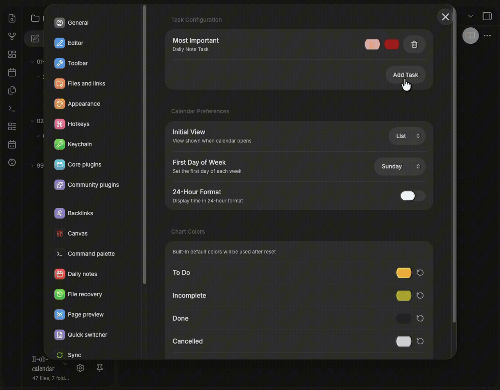
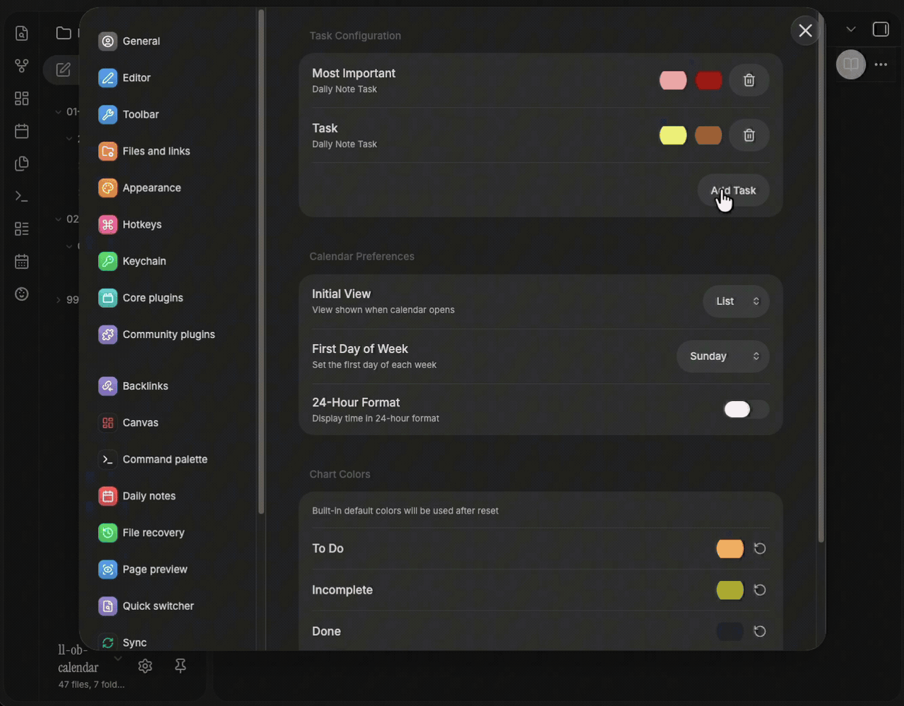
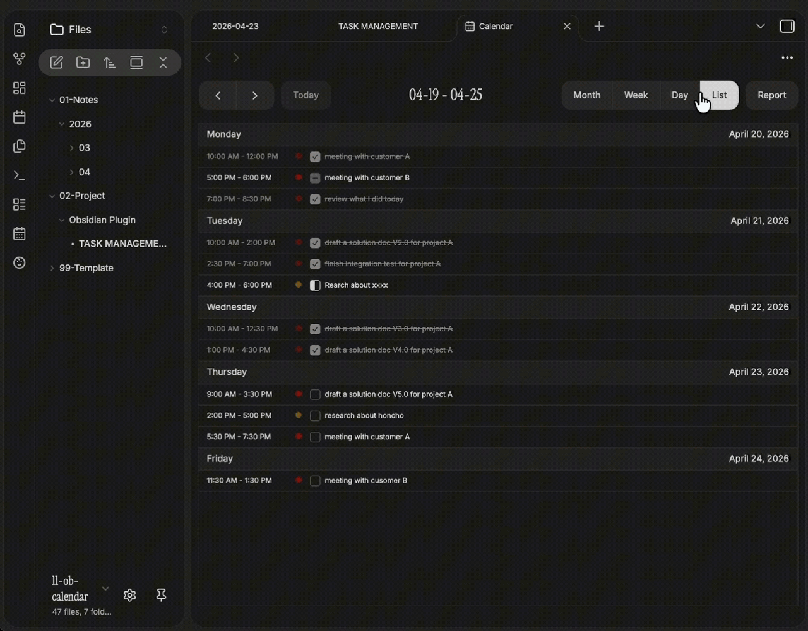
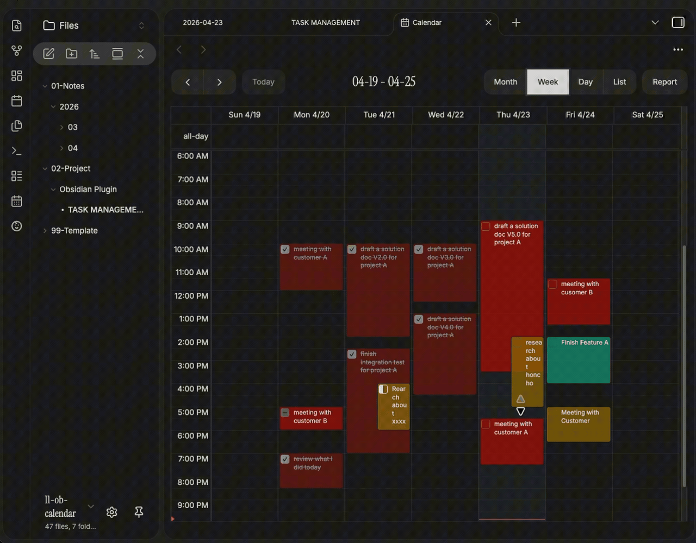
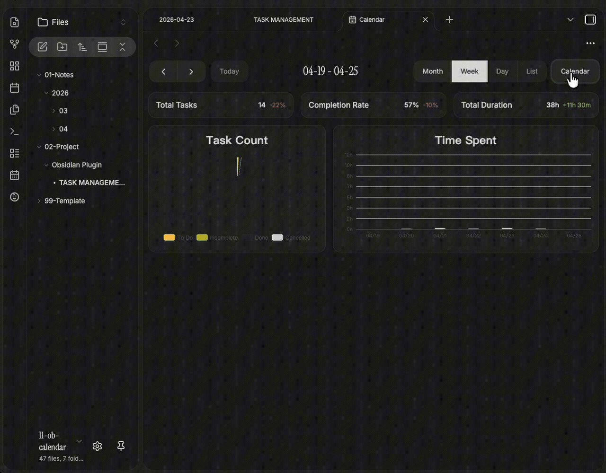
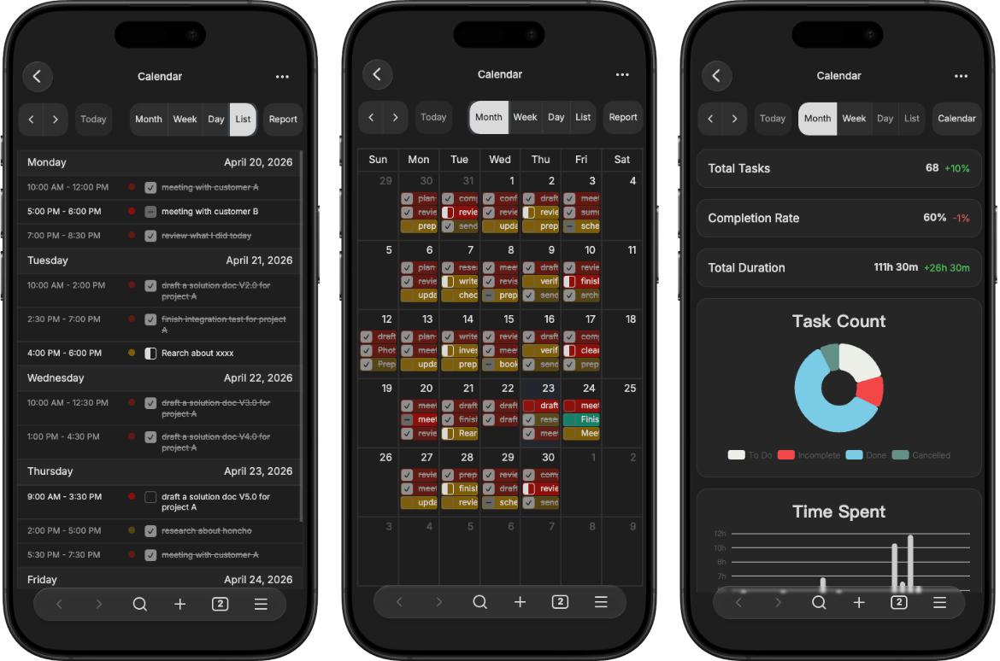
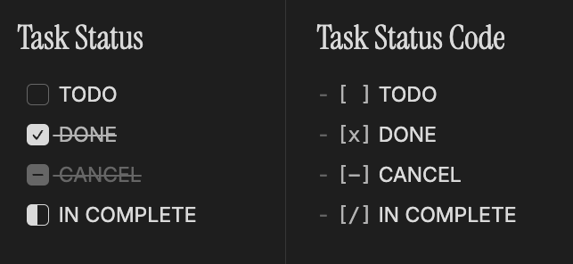

[EN](README.md) | [中文](README.zh.md)

# iCalendar

iCalendar is an Obsidian calendar plugin that visualizes and manages tasks from both **daily notes** and **project files** in an interactive calendar view.

## Features

### Task Management

Tasks come from two sources, each with its own color on the calendar:

- **Daily note tasks** — compatible with the built-in Obsidian daily notes plugin. Tasks are read from a configurable heading in each daily note.
- **Project tasks** — point to any Markdown file in your vault and pick a heading to pull tasks from.

### Calendar View

- Month, week, and list views with smooth switching
- Tasks color-coded by source and status
- Click a date to open the corresponding daily note
- Drag and drop to reschedule tasks
- Configurable 12 / 24-hour time format

### Task Management

- Click on empty space to create a task — auto-written to the corresponding daily note or project file
- Click an existing task to open the edit modal — title, time, status, and Markdown description
- Right-click a task to quickly change status or delete it

### Dashboard

Switch to the stats view for a visual summary of your work:

- **Stats cards** — total tasks, completion rate, total duration, with period-over-period comparison
- **Donut chart** — task status distribution
- **Bar chart** — daily time spent, switchable between week / month views

### Mobile Optimized

Deeply optimized layout and interactions for mobile devices — compact toolbar, touch-friendly editing, and responsive charts.

### Extended Checkbox Status

Works with themes that support alternate checkbox types (`[/]` in-progress, `[-]` cancelled, etc.).

### i18n

- Supports Chinese (zh-CN) and English (en)
- Follows Obsidian's language setting automatically

## Installation

### BRAT (Recommended)

1. Install the [BRAT](https://github.com/TfTHacker/obsidian42-brat) plugin
2. Add Beta Plugin: `https://github.com/that-yolanda/obsidian-calendar`
3. Enable the plugin

### Manual Installation

1. Download `main.js`, `manifest.json`, `styles.css` from the [latest release](https://github.com/that-yolanda/obsidian-calendar/releases)
2. Place the files in `<Vault>/.obsidian/plugins/icalendar/`
3. Enable the plugin in Obsidian settings

## Development

See [Development Guide](docs/development.md).

## Changelog

See [CHANGELOG.md](CHANGELOG.md).

## License

[MIT](LICENSE)
