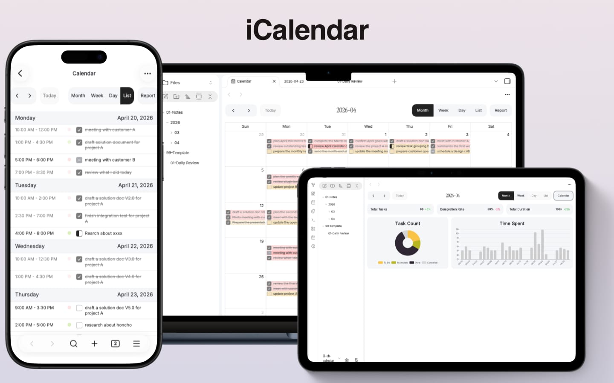

[EN](README.md) | [中文](README.zh.md)
# Obsidian Calendar

A FullCalendar-based Obsidian plugin that displays and manages tasks from daily notes in a calendar view.

## Features

### Calendar View

<!-- Screenshot: Month view with tasks displayed as colored blocks -->

- Switch between month, week, and list views
- Automatically reads tasks from daily notes and displays them by status with different colors
- Click a date to open the corresponding daily note
- Configurable 12/24-hour time format

### Task Management

<!-- Screenshot: Task creation/edit modal -->

- Click on empty calendar space to create a new task, auto-written to the corresponding daily note
- Click an existing task to open the edit modal, changes sync back to the daily note
- Set start time, end time, status, and description for tasks
- Built-in Markdown editor with live preview for task descriptions

### Context Menu

<!-- Screenshot: Right-click status menu on a task -->

- Right-click a task to quickly change status (todo / completed / in-progress / cancelled)
- Right-click to delete a task

### Dashboard

<!-- Screenshot: Stats dashboard with cards, donut chart, and bar chart -->

- Stats cards: total tasks, completion rate, total duration with period-over-period comparison
- Task status distribution donut chart
- Daily time spent bar chart, supports weekly / monthly / yearly views

### Mobile Support

<!-- Screenshot: Calendar view on mobile -->

- Optimized toolbar and layout for phone screens
- Task editing modal adapted for mobile interaction

### i18n

- Supports Chinese (zh-CN) and English (en)
- Follows Obsidian's language setting automatically

## Installation

### BRAT (Recommended)

1. Install the [BRAT](https://github.com/TfTHacker/obsidian42-brat) plugin
2. Add Beta Plugin: `that-yolanda/obsidian-calendar`
3. Enable the plugin

### Manual Installation

1. Download `main.js`, `manifest.json`, `styles.css` from the [latest release](https://github.com/that-yolanda/obsidian-calendar/releases)
2. Place the files in `<Vault>/.obsidian/plugins/obsidian-calendar/`
3. Enable the plugin in Obsidian settings

## Screenshots

Below are the suggested screenshots to add (replace this section after adding images):

| Screenshot | Description | Suggested filename |
|------------|-------------|-------------------|
| Calendar month view | Shows tasks as colored blocks on dates | `docs/screenshot/calendar.png` |
| Task modal | Creating or editing a task | `docs/screenshot/task-modal.png` |
| Context menu | Right-click to change task status | `docs/screenshot/context-menu.png` |
| Dashboard | Stats cards and charts | `docs/screenshot/dashboard.png` |
| Settings panel | Plugin settings page | `docs/screenshot/settings.png` |
| Mobile view | Calendar on mobile | `docs/screenshot/mobile.png` |

## Development

See [Development Guide](docs/development.md).

## Changelog

See [CHANGELOG.md](CHANGELOG.md).

## License

[MIT](LICENSE)
